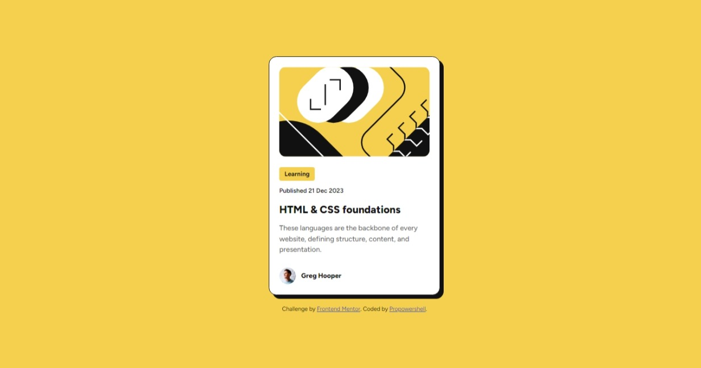

# Frontend Mentor - Blog preview card solution

## Table of contents

- [Overview](#overview)
  - [Screenshot](#screenshot)
  - [Links](#links)
- [My process](#my-process)
  - [Built with](#built-with)
  - [What I learned](#what-i-learned)
  - [Useful resources](#useful-resources)
- [Author](#author)
- [Acknowledgements](#acknowledgements)

## Overview
This is a solution to the [QR code component challenge on Frontend Mentor](https://www.frontendmentor.io/challenges/blog-preview-card-ckPaj01IcS)). Frontend Mentor challenges help you improve your coding skills by building realistic projects. 

### Screenshot



### Links

- Solution URL: [https://github.com/Propowershell/Propowershell.github.io/tree/main]
- Live Site URL: [https://propowershell.github.io/blog-preview-card-main/#]

## My process

1. First, I looked through the designs and started writing down tags that would be appropriate for each section of the QR Component.

2. I typed out the HTML structure of the page.

3. then I started adding styles until the QR Component looked very close to the original design.

4. I initialized the project as a public repository on GitHub.

5. And then configured the repository to publish the code to a web address.

### Built with

- Semantic HTML5 markup
- CSS Variables
- Flexbox

### What I learned

Working on this project helped reinforce my knowledge on CSS Box Model, I learned more about Flexbox and now have a special preference of when to use CSS Grid in a project(which I didn't make use of in this project).

To see how you can add code snippets, see below:

```html
<article>
      <span class="category">Learning</span>
      <p class="published-date">Published 21 Dec 2023</p>
      <h1 class="card-title">HTML & CSS foundations</h1>
      <p class="card-description">
        These languages are the backbone of every website, defining structure, content, and presentation.
      </p>
      </article>
```
```css
:root {
  --yellow: rgb(244, 208, 78);
  --gray-950: rgb(17, 17, 17);
  --gray-500: rgb(107, 107, 107);
  --white: rgb(255, 255, 255);
}
```

### Useful resources

- (https://css-tricks.com/snippets/css/a-guide-to-flexbox/) - This is an amazing article which helped me finally understand CSS FlexBox. I'd recommend it to anyone still learning this concept.

## Author

- Frontend Mentor - [@Propowershell](https://www.frontendmentor.io/profile/Propowershell)
- Twitter - [@prosper1910734](https://www.twitter.com/prosper1910734)
